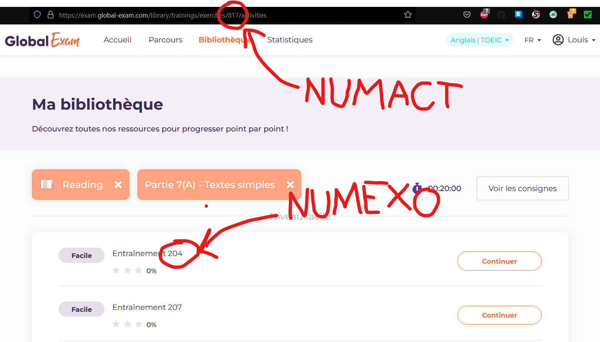

# <center>ANGL101</center>
## <center>Bot GlobalExams</center>

<br/>

### Installation de Selenium :
```bash
python -m pip install selenium
```

<br>

### Modifications du fichier <a href="infos.py">infos.py</a> :

* ```USERNAME``` : identifiant intranet
* ```PASSWORD``` : mot de passe intranet

Aller sur GlobalExams -> Exercices et choisissez un exercice <strong>SANS LE LANCER</strong>

* ```NUMACT``` : Numéro de l'activité (dans l'URL)
* ```NUMEXO``` : Numéro de l'entraînement


